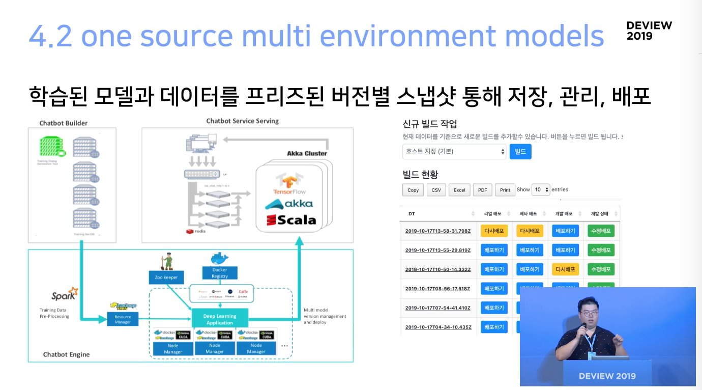

# 20200619 [DEVIEW2019] 챗봇 1만개의 모델 서빙하기 : AI 서비스 어디까지 해봤니

[원본 영상 : 챗봇 1만 개의 모델 서빙하기: AI 서비스 어디까지 해봤니](https://tv.naver.com/v/11212632)

## 요약

> 이 세션은 4명의 엔지니어로 1만개의 모델을 서빙한 경험을 공유한 세션입니다.
> 
> 인공지능 기술이 성숙해짐에 따라 인공지능의 경제적인 면을 살펴보지 않을 수 없다. 훈련하는 시간, 모델을 평가하고 개선하는 시간, 추론에 걸리는 시간 등은 모두 비용이며, 이를 효과적으로 줄이는 것이 중요하다.
> 성능에 치중된 무조건적인 최적화보다 **비용을 고려한 최적화**가 이루어져야 한다.
> 
> latency와 throughput은 이 점에서 매우 중요하다. 모델의 추론 속도는 빨라야 하고 많은 양의 데이터를 처리할 수 있어야 한다. 이 때문에 경제적인 모델을 설계하고 개발하는 것이 중요하다. 세션에서는 소프트웨어부터 하드웨어까지 다양한 방법을 통해 최적화를 진행한 것을 공유하였다.
> 
> 이 세션에서는 이런 생각에 기초하여 챗봇 빌더를 런칭한 경험에서 다음 두 가지를 강조하고 있다.
> 1 운영이 가능하도록 지표화된 서비스를 만들고, 과정을 자동화할 것
> 2 이전에 잘 되던 모델로 돌아갈 수 있는 장치를 마련할 것 - snapshot

## 1. 모델의 성격 파악하기

### 1.1 텍스트 ? 이미지 ? 음성 ?

결국 모델에 들어가는 인풋은 **어떤 텐서 형태의 피쳐**일 것.

이미지 모델을 다루지만 실제 이미지를 보지 못하는 사람도 있다. 

실제로 중요한 것은 모델의 규모와 서비스 형태, **규모와 실시간성 두가지가 중요**

배치성 작업인가? 예상되는 대량의 payload가 들어올 수 있는가?

어떤 형태의 서비스/모델인가에 따라 처음 설계부터 다시 해야 할 수도 있다.

대량의 payload를 꾸준히 받을 수 있고 가속기를 사용할 수 있다면 애초부터 다른 접근을 시도할 수 잇다. 이는 서비스의 기획 단계부터 준비되어야 한다.

서비스 요구사항에 따라 서버, 모바일, 임베디드 등 여러 환경 고려 필요. edge server node일 수도 있고.

우리는 ML을 서비스화해서 여러 곳에서 사용하고 있다. latency, 하나의 머신에서 얼마나 많은 일을 처리할 수 있는가를 앞으로 계속 얘기할 것.

### 1.2 안되는 것을 빠르게 포기하는 방법

데이터 없이 학습 없이 이루어지는 마술같은 ML : **미신러닝**

→ 수백 수천 토큰의 질의를 이해하는 모델

→ 도메인 전용 학습, 튜닝이 필요하지 않은 범용 모델

→ 10턴 이상의 문맥을 고려하여 이해하는 모델

안되는 것은 빠르게 포기

### 1.3 되는 걸 빠르게 파악하기

구축→훈련→평가→개선으로 이어지는 흐름을 자동화. AutoML

→ 자동으로 데이터셋을 개선하기

→ 자동으로 모델을 평가하고 튜닝하기

→ 유저의 암시적인 피드백을 통해서 데이터 개선하기

자동화는 비즈니스적 관점에서 아주 중요한 점. 학습 속도는 매우 중요한 지점이다.

운영이 가능하고 지표화를 통해 관리가 가능한 머신러닝 서비스를 만들어야 한다.

### 1.4 모델의 비용 계산하기

베이스 라인과 모델 앙상블의 중요성

언어별, 데이터 규모별 강점을 가지는 다양한 모델이 존재.

SotA(state-of-the-art) 하나로 모든 데이터를 최적으로 서비스하는 것은 어렵다.

모두 BERT로 갈 수는 없는 모델

BERT / ELMO / N-LSTM / Seq2Seq ...

모델의 비용 비교 : 계산 비용

계산 비용을 생각안할 수 없다.

인공지능도 돈을 벌어야 한다.

비용이 저렴하고

사전학습된 모델을 도메인별 fine-tuning하여 이용가능하며 

연산비용이 충분히 작고 최적화되어있으며

물리적인 용량이 작아 한정된 인프라에서도 다수를 서비스할 수 있으며

충분한 성능을 보장해야 한다.

즉 **비용을 고려한 최적화가 필요**하다.

## 2. Amdahl's law를 기억하며

이론적인 내용입니다.

비용에 대한 이야기를 포함하고, 구체적으로 어떤 고민을 가지고 있었는지에 대한 얘기

### 2.0 Amdahl's law 암달의 법칙, 암달의 저주

95%를 병렬화할 수 있는 코드가 있다고 가정.

가용한 모든 컴퓨터 자원을 투입하더라도, 성능 향상은 20%에 그친다.

현재 연산장치 수준에서 속도가 올라가는 것은 느려진 상태.

→ 구조를 유지하면서 코어수를 늘리고 멀티코어

→ GPU FPGA 등 전용 가속기를 활용

⇒ 하지만 그렇다고 이 법칙을 넘어설 수 있는 것은 아니다.

### 2.1 범용 환경? 전용환경?

언제나 네이버 데이터센터에 있다면 좋겠지만, 많은 환경과 이에 따른 제약이 있다.

B2B, B2C, B2B2C 등.

### 2.2 빠른 모델이 좋은 모델일까

예시로 다음 두 모델 비교

- Bi-LSTM - 병렬화가 충분히 진행되었다. 크기가 작다.
- BERT - 크기가 크다. 고급 사양의 가속기가 있다면 성능은 나온다.

계산 수행 시간과 총 계산 비용은 별도의 문제.

latency와 throughput을 고려해야 한다.

latency와 throughput:
latency는 작업이 수행되기까지 걸리는 시간으로 인한 지연이라고 생각하면 될 듯 하다. 영상을 볼 때 하드웨어 사양이 모자라 오디오 싱크가 맞지 않거나, 게임을 할 때 뚝뚝 끊기는 화면을 보는 것도 이러한 개념의 일종이라고 볼 수 있다.
throughput은 대상 시스템이나 프로세스를 통과하는 양, 속도 등을 말한다. 연산 속도를 표시하는 데에도 쓰인다.
참고 https://swev.net/35

### 2.3 경제적인 모델이 최고

학습의 추론과 성능 최적화가 곧 비용인 시대

현재 애초에 연산이 너무 무겁다. 연산량 자체가 많기 때문에 하드웨어별 throughput을 고려해야한다.

참고기사 [training a single ai model can emit as much carbon as five cars in there lifetimes](https://www.technologyreview.com/2019/06/06/239031/training-a-single-ai-model-can-emit-as-much-carbon-as-five-cars-in-their-lifetimes/#:~:text=Training%20a%20single%20AI%20model%20can%20emit%20as%20much%20carbon,has%20a%20terrible%20carbon%20footprint.&text=The%20artificial%2Dintelligence%20industry%20is,be%20a%20highly%20lucrative%20commodity.)

## 3. 조금만 더 줄어 주면 안될까?

### 3.1 모델과 대화하기, 그리고 설득하기

모델 레이어, 파라미터 튜닝

L1 Regularization

레이어간 파라미터 공유

컴퓨팅자원 친화적인 연산으로 교체

특정 장비별 오퍼레이션 최적화

연구가 활발히 진행되고 있다.

Knowledge distillation / quantization

모델의 정확도를 일부 포기해야한다.

### 3.2 그래도 어렵다. 모델러와 소통하기

공동의 목표와 성과로 이어져야 하고 서비스와 제품으로 묶여야 한다.

열심히 하는 것만으로는 안된다. **유기적으로 협업**하는 팀이 필요하다.

### 3.3 그래도 잘 안될거예요 이제 엔지니어에게 남은 모든걸 하기

프레임워크 코드도 커스터마이징을 한다.

엔지니어링 수준에서 최적화를 달성해야 한다. 연산 라이브러리도 교체한다.

JNI(Java Native Interface) 수준으로 서비스코드와 결합도 시도.

네이티브 바이너리도 시스템과 환경별로 생성

프로파일링을 통해 모델의 계산 비용 분석도 진행

알려진 최적화를 하나씩 서비스에 적용한다.

장비를 최적화. 시제품을 요청하기도 한다.

### 3.4 AVX512

확장 레지스터와 512bit SIMD 명령어를 지원하는 AVX-512

64b → 128b → 256b → 512b

예를 들어

a + b ⇒ 한번에 처리

a + b + c ⇒ 한번에 처리

성능 개선 사례

서비스에서 요구하는 latency는 만족.

### 3.5 AVX 512 VNNI

더 많은 하드웨어 가속도 가능하다.

모델 사이즈 1/10, latency는 3ms 안에서 최적화가 가능하다.

### 3.6 tensorRT

특정 환경 런타임을 기반으로한 추론 라이브러리 등 존재 : tensorRt, OpenVino 등

범용 연산에서 전용 연산으로 내려갈 수록 전력 대비 성능비는 훨씬 개선된다. (ex **NPU**) → 다음단계. 지금은 현재 상태에서 할 수 있는 최적화를 하는 것

## 4. 모델 정말 1만개를 서비스 했을까

실제로 1만개 서비스는 했다.

### 4.1 **autoML**, auto quantization

AutoML에서 사용 가능한 재료를 최대한 자동화

모델을 튜닝, 데이터를 튜닝, 필요한 피쳐를 다 만들어놓는 사전 작업

### 4.2 one source multi environment models

다양한 환경에서(일반서버, GPU, 웨어러블, 가상, 오케스트레이션) 서빙 가능한 모델을 하나의 소스와 빌드시스템으로 관리.

각 환경마다 연산 명령어셋도 다르기 때문에 이는 하나의 시스템과 빌드에서 관리할지를 고려

빌더를 서비스할 때 학습된 모델과 데이터를 프리즈된 버전별 **스냅샷**을 통해 저장,관리,배포

잘 되던 것으로 돌려놓는 것은 비즈니스에서 매우 중요.

이것들을 지탱하는 것은 네이버의 딥러닝 분산 플랫폼 C3DL 기반. 컨테이너 기반으로 cpu 자원 사용

### 4.3 decenteralized clusters - kaa

비중앙화된 분산 클러스터를 활용한 머신러닝 모델 서빙 엔진을 설계. scala로 구현된 akka actor model 사용

### 4.4 decenteralized clusters - kaa

spark이라는 분산처리시스템의 역할, scala 많이 사용

tensorflow

하나의 코드베이스에서 엔진, 전처리, 빌드 전부 하나의 코드 베이스에서 동작하도록 노력

모델의 실험과 평가에 대한 공통 코드를 **정적 모듈화** : **신속한 모델 설계, 실험**

비용 절감에 핵심적인 역할

### 4.5  decenteralized clusters - kaa

on premise 등 b2b를 위한 패키징을 시스템 초기 설계수준에서 고려

jar, zip, single docker image

### 4.6 decenteralized clusters - kaa

클러스터는 적어도 두 벌 이상의 데이터가 존재.  ? 이것은 무엇인가

여러 개의 클러스터의 노드를 관리하면서 죽은 노드를 걸러내고 비동기처리 하는 등 효율적인 자원 활용

네이버 검색의 인프라시스템을 통한 모델 오프로딩

### 4.7 decenteralized clusters - kaa

4명의 엔지니어로 15만 개 이상의 모델을 학습하고 글로벌 환경에서 1만여 개의 모델을 서빙

## 마무리

앞으로 모든 sw 서비스는 머신러닝이 들어갈 것.