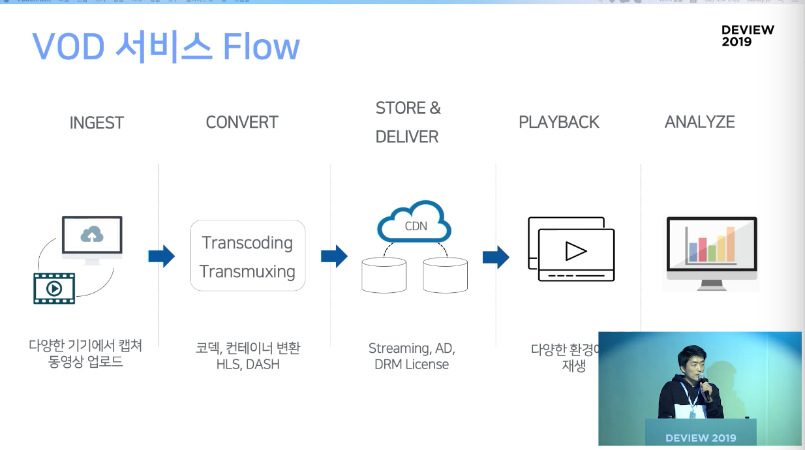
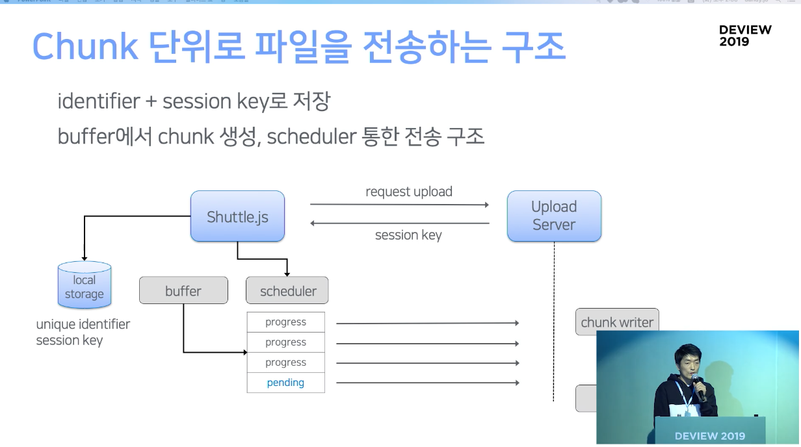
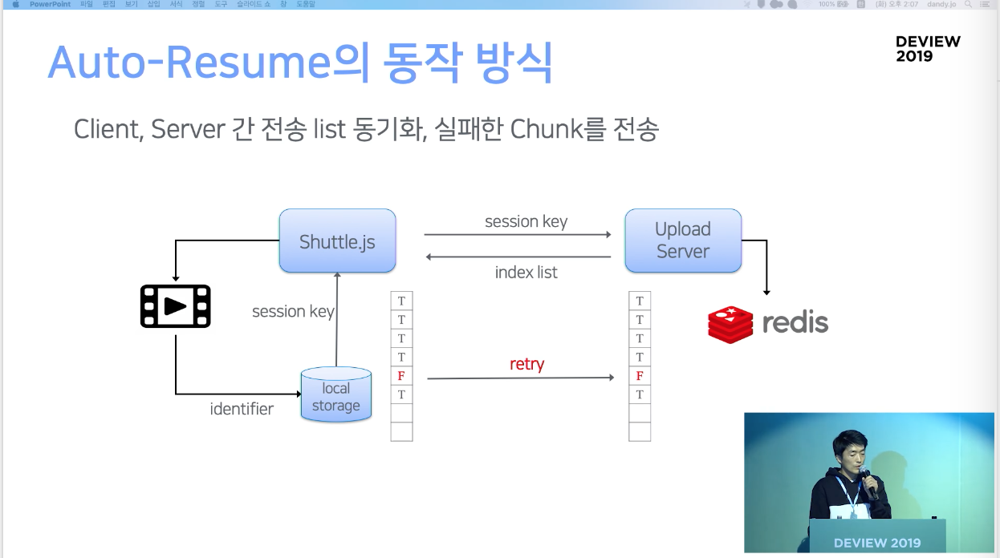
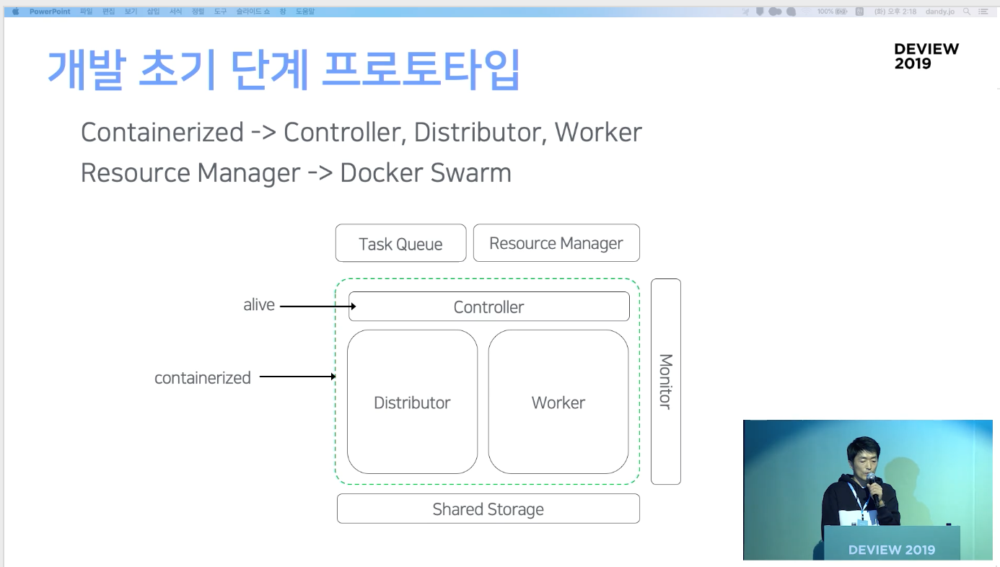
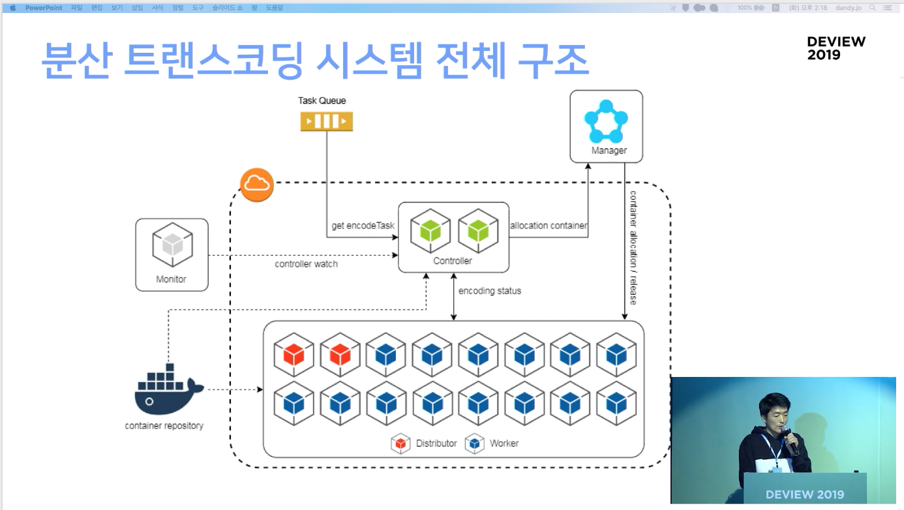

# 20200708 [DEVIEW2019] 네이버 동영상 서비스를 지탱하는 VOD 플랫폼 개발기

[네이버 동영상 서비스를 지탱하는 VOD 플랫폼 개발기](https://tv.naver.com/v/11208574/list/534045)

## 요약

> 이 세션은 네이버 동영상 서비스의 VOD 플랫폼의 업로드부터 재생까지의 딜리버리와 스트리밍에서의 서비스 및 구조 개선에 대한 세션입니다.
> 
> 중점적으로 다룬 내용은
> 	1) 글로벌 서비스를 하면서 필요한 구조 및 성능 개선점,
> 	2) 대형화된 동영상을 효율적으로 트랜스코딩하는 시스템의 구축,
> 	3) 스트리밍 서비스의 기술과 이를 더울 원활히 제공하기 위한 방법 등
> 입니다.

## 1. VOD 서비스에서 고려사항

### 일반적인 VOD 서비스의 Flow

포맷 변환은 필수. 광고, DRM 등 패키징 작업 필요

키워드를 이용해 서비스, 마케팅에 활용

### 다양한 환경에서 동영상 재생

파편화된 동영상 재생 환경

어떤 코덱으로 트랜스코딩해야 하는지, 스트리밍을 위해서는 어떤 프로토콜을 사용해야 하는지 등 고려할 사항이 많다.

글로벌 서비스를 위한 딜리버리

### 대용량 시스템의 운영

서비스가 커짐에 따라 운영에 대한 어려움이 생긴다. 해외에서도 수십GB의 영상을 손쉽게 업로드해야 하고, 데이터를 효과적으로 저장하고 관리해야 한다.

### 수익화 및 분석 도구의 개발

광고기반? 구독기반? 광고 플랫폼을 연동하기 위한 기술이 필요

유료 서비스에 대해서는 콘텐츠 보호가 필요하다

→ **이렇게 VOD 플랫폼을 개발하면서 얻은 경험 공유**

## 2. 업로드에서 트랜스코딩까지 최적화

### 동영상 대형화로 나타나는 문제

동영상이 커진다. 시스템의 트래픽, 부하는 늘어난다.

업로드하다가 끊기는 문제, 뒤에서 일어나는 트랜스코딩도 늘어난다.

**업로드 방식의 변화**

한 번에 여러 개의 파일을 업로드 하는 등의 멀티태스킹

멀티파일 업로드, 업로더 UI 등

**특히 해외에서 업로드 이슈**

해외 CP에서 대용량 파일을 받기 힘든 상황

### 업로드 모듈의 기본 컨셉

- 작은 chunk 단위로 나눠서 전송
- 실패시 자동 복구
- 멀티파일 업로드
- 자바스크립트 기반 SDK

**chunk 단위로 파일 전송**

identifier는 해당 영상을 특정하기 위한 key의 역할을 함

session key를 서버로부터 받아 로컬 스토리지에 저장

전송이 완료되면 서버측에서 파일을 머지

**Auto Resume 동작 방식**

세션 키를 이용해서 서버에 저장된 것과 전송 파일을 대조하여 검증.

서버로부터 인덱스 리스트를 받아 실패한 chunk만 골라서 전송할 수 있도록 함

### 업로드 서버의 로드밸런싱 문제

일반적인 웹서비스에서는 L4를 사용. 고가의 장비이기 때문에 동영상 트래픽에 사용하기에는 적합하지 않다.

대체하기 위해 GSLB(Global Server Load Balancing)를 구성하기도 했다.

클라이언트와 서버는 데이터를 다이렉트로 전송할 수 있기 때문에 문제가 해결되는 듯 했지만, TTL시간동안은 클라이언트에서 캐싱을 한다. 전체 트래픽이 빠지는데 시간이 오래걸린다.

GSLB, Global Server Load Balancing이란?
DNS 서비스의 발전된 형태이다.
DNS 서버는 Round-Robin 방식을 사용.
기존 DNS 서버는 로컬 데이터베이스의 IP 리스트를 확인해서 그 중 하나를 반환할 뿐, 서비스의 성능, 지연, 실패 등은 고려하지 않는다.
GSLB는 서버의 정보를 모니터링하고 있기 때문에, 서버의 상태, 서버의 로드, 레이턴시, 위치 정보를 통해 로드가 적은 서버를 반환하거나, 레이턴시가 작은 서버를 반환하거나, 해당 지역을 서비스하는 서버를 반환하는 등의 역할을 할 수 있다.

**GSLB + Eureka를 이용한 방법**

GSLB Geolocation으로 가까운 POP 할당

Service Discovery는 Spring Cloud의 Eureka. Eureka로부터 현재 업로드 가능한 서버의 목록들을 받아온다.

클라이언트는 이 받은 목록을 통해 여러 서버에 파일 나눠서 저장

### 해외 구간의 전송 속도 개선

해외는 로컬 네트워크의 품질이 매우 들쭉날쭉하다. ⇒ packet loss

국내 IDC까지 전송해야 하는데, 퍼블릭 인터넷만으로는 업로드 불가능.

**Global 업로더 구조 개선 1**

파일이 커지면 재전송을 위한 대기시간이 길어진다.

해외 주로 POP에 업로더를 설치.

해외사용자 → 현지 POP : 빠르게 피드백이 가능

현지 POP → 국내 IDC : 전용선 사용 - 파일이 모두 올라와야 출발

⇒ 기존보다 오류 적어짐, 해외에서 안정적인 업로드. 하지만 용량이 커짐에 따라 현지 POP에서 파일을 머지하는 시간이 오래걸린다. 그만큼 한국에서 transcoding에 걸리는 시간이 오래걸리게 된다.

**Global 업로더 구조 개선 2**

Transfer Queue를 통해 Relay

File merge는 국내 서버에서만 처리

전송 지연이 거의 발생하지 않음

**Global 업로드 모델의 한계**

대형화에는 부적합. 전용회선의 대역폭에는 제한이 있다.

트랜스코딩 클러스터, 오브젝트 스토리지, 분산DB 구축 필요

**업로드 이후 작업 프로세스**

정합성 체크, 헤더정보, 썸네일 지정

트랜스코딩, 패키징, 메타정보 추출 등 작업 처리

### Ingest 단계의 작업을 관리

10단계 이상의 Task가 존재하기 때문에, 이를 관리해줘야 하는 번거로움이 있다.

**기존 구조의 문제점** - 단계가 연결된 시스템 구조, 단위 작업 실패시 복구가 어렵다.

**개선**

→ Orchestrator를 만들고 위임한다 - Task간 Dependency 제거, 관리를 맡긴다

→ 작업 제어와 모니터링을 편리하게. Orchestrator는 RabbitMQ, redis를 사용. RabbitMQ의 큐잉 상태를 모니터링하면서 Task의 수를 조절한다.

### 서비스별 문제들

**기존 트랜스코딩 클러스터 상황?**

encode 시스템을 DB에서 관리. 인코딩 설정을 미리 만들어서 주입하는 방식. 서비스별로 서로 다르게 설정해줘야 한다.

**로드밸런싱 문제**

서비스별로, 시간별로 요청량이 다르다. 트래픽이 증가하면 수동으로 팜을 늘려줘야 하는 구조.

**개선**

→ 트랜스코더 클러스터 구조 개선.

자체 트랜스코더 내재화, preset을 Runtime에 주입. 

Orchestrator로부터 Task를 할당받도록 하여 DB 의존성을 제거한다.

⇒ 구조개선을 통해 운영은 편해졌다. 하지만 인코딩 속도는 아직 문제. 이는 여러 서버에서 동시에 처리하는 것이 좋다.

### 새로운 트랜스코딩 시스템의 요구사항

저녁에 6시간짜리 Full Clip이 올라오면 새벽이나 되어야 노출된다.

**분산 트랜스코딩의 컨셉**

하나의 영상을 여러 조각으로 분할, MapReduce와 비슷하다고 생각하면 편하다.

**분산 시스템의 리소스 제어**

사내에서 Docker Swarm을 지원

### 개발 초기 단계의 프로토타입

### 대량 컨테이너 배포시 지연 문제

사실 현재 이 용도로 컨테이너를 사용하는 곳이 많지 않다.

분산 효과를 위해서는 많은 worker가 필요하다. 200개 worker가 동시에 배포되는데 최대 20-30초정도 걸린다.

우회하는 방법으로 그룹별로 할당하여 순차적으로 scale-out하는 방법을 사용.→?

20개 단위시 30ms 소요. 성능상 크게 떨어지는 부분은 없게 만들었다.

### 네트워크 속도 저하 문제

worker간의 동영상 전송시 overlay network의 병목현상

host network를 사용하도록 변경했고, 이경우에는 port를 관리해야 하는 문제가 생겼다.

→ port table를 미리 만들어놓고 group 단위로 필요할 때 할당받아 사용하는 방법을 적용했다.

### 적용 효과

5시간 이상 동영상이 3분내 처리되었다.

720p해상도는 42배 이상 빠르다.

## 3. 안정적인 스트리밍 서비스

### 동영상 재생에 필요한 요소들

플레이어의 기능이 많아졌다 → 재생과 렌더링에 더 많은 정보가 필요하다.

전송하는 규칙도 다양. 재생 시스템 자체의 복잡도도 높다.

**재생 플랫폼의 변화과정**

flash player → iphone : OEM player. → html5 ⇒ **native player(현재)**

**Global 스트리밍 프로토콜 현황**

HLS(apple), Mpeg-Dash(ms), RTMP, Smooth Streaming 등으로 많이 쓰고있다.

**왜 HLS를 많이 사용하나?**

HLS는 애플의 스트리밍 프로토콜. 안드로이드에서도 HLS를 지원.

**모든 환경에서 가능?**

웹에서는 지원하고 있는 브라우저가 많지 않다.

웹에서는 제약이 많다. 컨테이너를 hls.js, dash.js등으로 사용하고 있다.

### 어떤 스트리밍을 사용해야 할까?

재생 안정성, 넓은 커버리지

현재는 스트리밍-HLS, drm-dash을 중점적으로 사용중

**멀티 스트리밍 지원시 고려사항**

플레이어, 재생 시스템의 구조

프로토콜간의 컨테이너 호환성

### 스트리밍 방식과 메타정보

미디어스트림+매니페스트 구조

상호간 구조적인 호환성은 없다.

- Progressive Download(PD) - 미디어스트림 only, 별도 전달필요
- HLS - 미디어스트림 + 메타, 버전에 따라 다르다
- Dash - 미디어스트림 + 메타, 기술표준, 넓은 표현

**재생 시스템의 구조**

API가 PD의 manifest 역할도 제공해야 한다.

사용가능한 모든 프로토콜을 제공한다 : 다른 프로토콜로 재생하더라도 지연시간을 낮춘다.

manifest 데이터가 부실하면 플레이어가 처리해야 할 부담이 늘어난다.

ex) 재생중인 화질 표현 - resolution을 파싱하여 사용하지만, 하지만 세로 영상일 경우?

→ 조건이 복잡해진다.

⇒ manifest의 내용이 확충되어야 한다.

group-id를 지정하고 해상도 명칭으로 매핑.

### 24/7/265 재생 서비스 보장

장애가 발생하지 않고, 만약 발생하더라도 fail over할 수 있는 구조가 필요.

- 기존에는 single-IDC, single-CDN에서 재생하고 있었다. data source - origin - CDN이 1:1로 매핑
- 이를 같은 IDC간 자유롭게 이동을 할 수 있는 구조가 필요. 네트워크 확충을 통해 해결.

### 장애 발생시 fail over

매핑 정보를 분배하고 제어한다. 이를 위해서는 플레이어로부터 데이터를 받아오고 있고 이를 바탕으로 서비스를 모니터링 하고 있다.

## 4. 대용량 플랫폼의 거버넌스

### VOD 플랫폼의 운영 현황

네이버 전사 VOD 서비스 제공

수십PB 스토리지, 초당 3만건 이상 트래픽 처리

모듈 100개, 2000대 서버, 3개 IDC 분산

⇒ 크고 작은 장애에 대한 위험성에 노출.

**초기 좋은 설계도 좋지만 관리 방법도 중요하다.**

### 지표 수집과 모니터링

시스템 별 모니터링 지표 정의를 잘해야한다.

증설해야 할 시점이 언제인지 판단하는 것 중요.

현재 실행하고 있는 프로세스 중 잘못된 프로세스가 어느것인지 구분하는 것도 중요하다.

데이터 수집 및 시각화 중요.

알림 시스템

초반 - 모든 지표를 모아서 한 번에 대시보드로 제공하려고 하였다.

→ 용도별 특화된 시스템으로 구성하여 사용

### 시스템 가용량 점검하기

주기적으로 구간별 아키텍처를 갱신(2회/1년)

미리 구간별 병목지점 예측. 

모듈별, 구간별 성능 테스트. 가용량 측정표 작성

→ 이를 바탕으로 성능 튜닝 지점을 파악

### 장애 관리 프로세스

장애 리포트

타임라인

원인 찾기

결과 리뷰

### 이외에도

- 플랫퐁의 개발 원칙이 있어야 한다.

    개발과 운영은 크고 작은 결정의 연속이다.

    고가용성/재사용성을 위한 서례, 클라이언트 설정 방지 원칙

- 자동화에 대한 지속적인 노력이 필요하다.

    시스템, 서비스가 늘어날 수록 시스템 자체가 오버헤드로 작용

### 앞으로

- 딥러닝 기반 트랜스코딩

    인코딩 효율화가 중요하다. 딥러닝 기반 인코딩 최적화 기술을 준비중

- immersive 동영상 경험, 처리기술

    8K/60fps 트랜스코딩 기술, VR서비스

    dolby vision/atmos/hdr+등

- 동영상 메타정보 DB 서비스